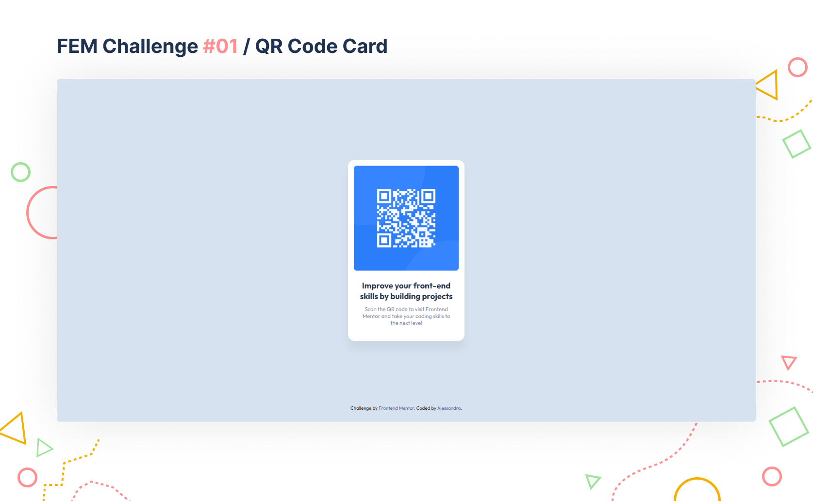

# Frontend Mentor - QR code component solution

This is a solution to the [QR code component challenge on Frontend Mentor](https://www.frontendmentor.io/challenges/qr-code-component-iux_sIO_H). Frontend Mentor challenges help you improve your coding skills by building realistic projects. 

## Table of contents

- [Overview](#overview)
  - [Screenshot](#screenshot)
  - [Links](#links)
- [My process](#my-process)
  - [Built with](#built-with)
  - [What I learned](#what-i-learned)
  - [Continued development](#continued-development)
- [Author](#author)
- [Acknowledgments](#acknowledgments)

## Overview
I decided to tackle this challenge by using [Sass](https://sass-lang.com/) and [BEM methodology](https://en.bem.info/methodology/). I'm not too familiar with them, so I decided this challenge would be a nice way to learn.

### Screenshot



### Links

- Live Site URL: [Add live site URL here](https://your-live-site-url.com)

## My process

### Set up sass + gulp + browsersync workflow
Although I have set up a file structure in the past with Sass, I decided to use [Yeoman](https://yeoman.io/) to generate the files necessary for the sass + gulp + browsersync workflow that I adopted in this project. The generator I used is `gulp-sass-boilerplate` by [coder-coder](https://github.com/thecodercoder/generator-gulp-sass-boilerplate).

### Built with

- Semantic HTML5 markup
- CSS custom properties
- Flexbox
- Sass + Gulp
- Figma (to help estimating margins and paddings for the design provided by Frontend Mentor)

### What I learned

I learned about the `hsl` colour notation and how it can be used to specify colours in a project.
`hsl` stands for __HUE__, __SATURATION__,__LIGHTNESS__.

```css
:root {
	--white: hsl(0, 0%, 100%);
	--light-gray: hsl(212, 45%, 89%);
	--grayish-blue: hsl(220, 15%, 55%);
	--dark-blue: hsl(218, 44%, 22%);
}
```

While I was trying to centre the card in the middle of the page, I discovered that the `<body>` had the same `height` as its content. I needed the `height` to span the whole page, if I wanted `flexbox` to work properly and centre the card. My solution became as follows:

```css
body {
  //...
  min-height: 100vh;
}
```

### Continued development

I would like to re-create this project in React. I barely started looking at React, so a project with a small scope like this one is perfect for learning purposes.

## Author

- Frontend Mentor - [@ASemeraro](https://www.frontendmentor.io/profile/ASemeraro)

## Acknowledgments

I think I wouldn't have been able to even feel confident enough to take a challenge like this, if it wasn't for [coder-coder](https://www.youtube.com/thecodercoder), a great and inspiring YouTuber. I highly recommend her channel if you are a beginner front-end developer.